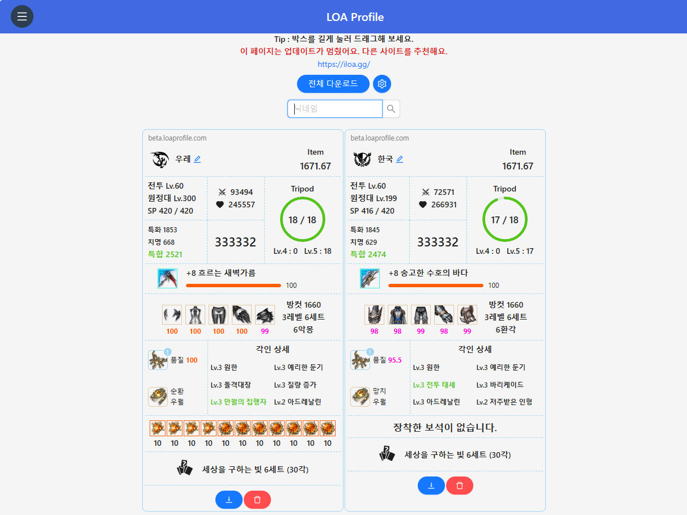
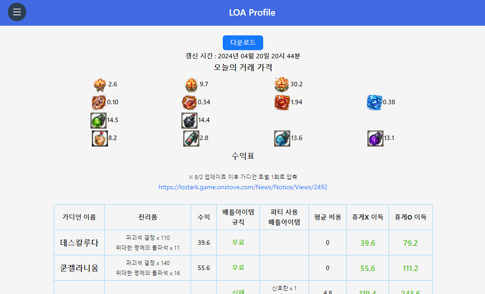
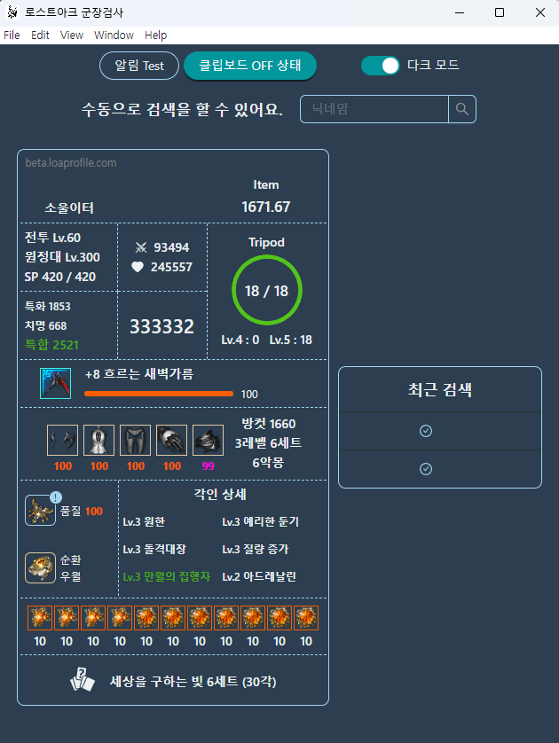

  
  
  

    LOA Profile : 로스트아크 군장검사, 가디언 수익계산
  

  

    
    
    
    
  

<!-- Content -->

 

### ❌ This repository is deprecated.

| Date       | Description  |
| ---------- | ------------ |
| 2022-10-09 | Open website |
| 2023-11-11 | Final update |
| 2024-10-27 | Archived     |

 

  
🖼️ Past screenshots

  
  
  

